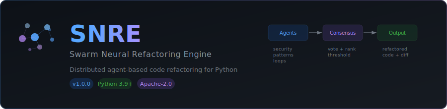
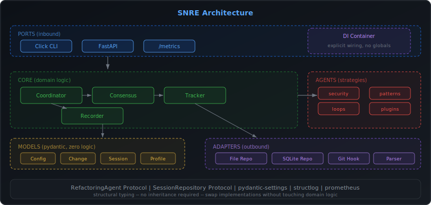

<p align="center">
  
</p>

<p align="center">
  <a href="https://github.com/moonrunnerkc/snre/actions/workflows/ci.yml"></a>
  <a href="https://www.python.org/downloads/"></a>
  <a href="LICENSE.md"></a>
  <a href="https://github.com/moonrunnerkc/snre"></a>
  <a href="https://pydantic-docs.helpmanual.io/"></a>
  <a href="https://fastapi.tiangolo.com/"></a>
</p>

<p align="center">
  Distributed agent-based code refactoring for Python.<br>
  Three specialized agents analyze, vote via consensus, and ship refactored code.
</p>

---

## Table of Contents

- [What It Does](#what-it-does)
- [Proof It Works](#proof-it-works)
- [Install](#install)
- [Quick Start](#quick-start)
- [Architecture](#architecture)
- [Agents](#agents)
- [Configuration](#configuration)
- [API Reference](#api-reference)
- [Testing](#testing)
- [Observability](#observability)
- [Docker](#docker)
- [Known Limitations](#known-limitations)
- [License](#license)

---

## What It Does

SNRE feeds your Python source code through multiple refactoring agents that
each specialize in a specific class of improvement. Agents independently
analyze the code, propose concrete changes with confidence scores, and vote
on each other's proposals. Only changes that pass consensus are applied.

```
Source File ──> Coordinator ──> Agents (analyze + suggest) ──> Consensus ──> Apply ──> Output
                    │                                              │
                    └── iterates until no changes pass ────────────┘
```

Each iteration:
1. Every active agent scans the current code and proposes `Change` objects.
2. All agents vote on all proposals (0.0 to 1.0).
3. The consensus engine rejects anything below threshold (default 0.6).
4. The highest-confidence accepted change is applied.
5. The loop repeats until nothing passes or `max_iterations` is reached.

Evolution history and snapshots are recorded at every step.

---

## Proof It Works

Tested on Python 3.12.12. Results from a real run on 2026-02-13:

```
$ pytest tests/ -v --tb=short

49 passed in 2.23s
```

### Real agent output against [`examples/sample_refactor.py`](examples/sample_refactor.py):

```
=== security_enforcer.analyze() ===
  issues_found: 2
  security_risks: ['command_injection:eval...', 'unsafe_deserialization:eval...']
  confidence: 0.9

=== pattern_optimizer.suggest_changes() ===
  [OPTIMIZATION] confidence=0.70: Convert to list comprehension

=== loop_simplifier.suggest_changes() ===
  [OPTIMIZATION] confidence=0.90: Replace range(len()) with enumerate()
```

> The security agent detected `eval()` and command injection risks.
> The pattern optimizer found list comprehension opportunities.
> The loop simplifier caught `range(len())` anti-patterns.
> These are real outputs, not mocked. Run it yourself with the install steps below.

### Test breakdown (49 tests, all pass)

| Category | Count | What they verify |
|---|---|---|
| Config validation | 7 | defaults, explicit values, boundary rejection for threshold/agents/iterations/timeout, unknown kwarg rejection |
| Agent inheritance | 9 | `isinstance(agent, BaseAgent)` for all 3 agents, real `analyze()` / `suggest_changes()` / `vote()` / `validate_result()` calls, priority + threshold |
| Core contracts | 5 | coordinator agent registration, consensus vote collection, change tracker diffs, evolution recorder paths |
| Agent behavior | 7 | pattern optimizer analysis, security scan, loop optimization, suggestion generation, validation, suggest_changes for security + loop agents |
| Integration | 2 | CLI instantiation, API instantiation |
| Error handling | 3 | invalid code, empty code, agent voting edge cases |
| Data models | 4 | Change round-trip, RefactorSession creation + serialization, enum members |
| Error hierarchy | 3 | base error, subclass chain, raisability |

---

## Install

```bash
git clone https://github.com/moonrunnerkc/snre.git
cd snre
python -m venv .venv
source .venv/bin/activate
pip install -r requirements.txt
pip install -e .
```

Verified dependency versions (as installed):

| Package | Version | Role |
|---|---|---|
| pydantic | 2.12.5 | model validation |
| pydantic-settings | 2.12.0 | typed config from env/yaml |
| fastapi | 0.129.0 | async API |
| click | 8.1.7 | CLI framework |
| libcst | 1.1.0 | concrete syntax tree transforms |
| structlog | 25.5.0 | structured logging |
| prometheus-client | 0.24.1 | metrics |
| filelock | 3.21.2 | concurrent file safety |
| uvicorn | 0.40.0 | ASGI server |
| PyYAML | 6.0.1 | config file parsing |

---

## Quick Start

### CLI

```bash
# refactor with all enabled agents
python -m snre start --path examples/sample_refactor.py

# pick specific agents
python -m snre start --path examples/sample_refactor.py --agents security_enforcer,pattern_optimizer

# check session status
python -m snre status <session-id>

# validate only (no changes applied)
python -m snre validate --path examples/sample_refactor.py
```

### API

```bash
# start FastAPI server
python -m snre api --host 0.0.0.0 --port 8000

# start a refactoring session
curl -X POST http://localhost:8000/refactor/start \
  -H "Content-Type: application/json" \
  -d '{"target_path": "examples/sample_refactor.py", "agent_set": ["security_enforcer"]}'

# check status
curl http://localhost:8000/refactor/status/<session_id>

# get results
curl http://localhost:8000/refactor/result/<session_id>
```

OpenAPI docs auto-generated at `http://localhost:8000/docs`.

---

## Architecture

<p align="center">
  
</p>

```
snre/
├── models/          # pydantic data models (config, changes, session, enums, profiles)
├── agents/          # protocol + registry + 3 agent implementations
├── core/            # coordinator, consensus engine, tracker, recorder
├── ports/           # Click CLI, FastAPI app factory
├── adapters/        # file/sqlite repository, git hooks, code parser
├── errors.py        # SNREError hierarchy
├── di.py            # explicit DI container
└── __main__.py      # python -m snre entry point
```

**26 modules, ~2,000 lines** in the `snre/` package.

### Design decisions

| Pattern | Why |
|---|---|
| **Protocol over ABC** | Agents satisfy [`RefactoringAgent`](snre/agents/protocol.py) via structural typing. No inheritance required. Any class with the right shape works. |
| **Repository pattern** | Session state accessed through a [`SessionRepository`](snre/adapters/repository.py) protocol. File-based and SQLite implementations included. Swap without touching domain code. |
| **Explicit DI** | [`Container`](snre/di.py) wires all dependencies at init. No global state, no service locator. Tests create isolated containers. |
| **App factory** | FastAPI app built via [`create_app()`](snre/ports/api.py). Testable with `httpx.AsyncClient`. |
| **Event hooks** | `EvolutionRecorder` subscribes to coordinator callbacks. The coordinator never imports the recorder. |
| **Stateless consensus** | `calculate_consensus()` is a pure function. Threshold passed as argument, not stored in state. |

---

## Agents

Three built-in agents, each targeting a different class of improvement:

| Agent | Priority | Confidence Threshold | Detects |
|---|---|---|---|
| `security_enforcer` | 9 (highest) | 0.8 | SQL injection, hardcoded secrets, `eval()`, `os.system()`, command injection |
| `pattern_optimizer` | 7 | 0.6 | List/dict comprehension opportunities, f-string conversions, context manager usage |
| `loop_simplifier` | 6 | 0.7 | `range(len())` anti-patterns, `sum()`/`any()`/`all()` replacements, `enumerate()` usage |

Priority determines which agent's suggestion wins when multiple agents propose conflicting changes at the same location.

### Agent protocol

Any class matching this shape is a valid agent -- no inheritance needed:

```python
class RefactoringAgent(Protocol):
    agent_id: str
    def analyze(self, code: str) -> AgentAnalysis: ...
    def suggest_changes(self, code: str) -> list[Change]: ...
    def vote(self, changes: list[Change]) -> dict[str, float]: ...
    def validate_result(self, original: str, modified: str) -> bool: ...
```

### Plugin system

Third-party agents are discovered via `importlib.metadata` entry points:

```toml
# in your agent's pyproject.toml
[project.entry-points."snre.agents"]
my_agent = "my_package.agent:MyAgent"
```

The `AgentRegistry` picks up installed plugins automatically alongside built-in agents.

---

## Configuration

### [`config/settings.yaml`](config/settings.yaml)

```yaml
swarm:
  max_concurrent_agents: 5
  consensus_threshold: 0.6        # 0.0-1.0, changes below this are rejected
  max_iterations: 10
  timeout_seconds: 300

tracking:
  enable_evolution_log: true
  snapshot_frequency: 5
  max_snapshots: 100

integration:
  git_auto_commit: false
  backup_original: true
  create_branch: true
  branch_prefix: "snre-refactor"

performance:
  cache_ast_parsing: true
  parallel_agent_execution: false  # async via asyncio.to_thread in snre/ package
```

### [`config/agent_profiles.yaml`](config/agent_profiles.yaml)

Defines per-agent priority, threshold, enabled/disabled state, and pattern lists.
Includes two future agents (`performance_optimizer`, `readability_enhancer`) currently disabled.

### Environment overrides

All `SNREConfig` fields accept `SNRE_`-prefixed env vars:

```bash
export SNRE_CONSENSUS_THRESHOLD=0.8
export SNRE_MAX_CONCURRENT_AGENTS=3
export SNRE_TIMEOUT_SECONDS=600
```

---

## API Reference

Full spec in [API_SPEC.md](API_SPEC.md). Key endpoints:

| Method | Path | Description |
|---|---|---|
| `POST` | `/refactor/start` | Start a refactoring session |
| `GET` | `/refactor/status/{id}` | Session status and history |
| `GET` | `/refactor/result/{id}` | Final result with diff and metrics |
| `GET` | `/health` | Health check |
| `GET` | `/metrics` | Prometheus metrics |
| `GET` | `/docs` | OpenAPI interactive docs (Swagger UI) |

---

## Testing

```bash
# full suite
pytest tests/ -v --tb=short

# with coverage
pytest tests/ -v --cov=snre --cov=agents --cov=core --cov-report=term-missing

# fast fail
pytest tests/ -v -x --tb=short
```

CI runs on Python 3.9 and 3.11 via [GitHub Actions](.github/workflows/ci.yml).
The pipeline includes: security scan (bandit), code quality (ruff, mypy), unit tests, and integration tests.

### Test location

```
tests/
├── unit_tests/
│   ├── test_contracts.py     # 33 tests: config, agents, core, interfaces, errors
│   └── test_functional.py    # 16 tests: agent behavior, integration, error handling
└── (future: unit/, integration/, regression/ per target architecture)
```

---

## Observability

### Structured logging

JSON logs via `structlog` with correlation IDs per session.
Console output in development, JSON when `SNRE_LOG_FORMAT=json`.

```python
# what a log line looks like
logger.info("refactoring.step_applied",
    session_id=str(session_id),
    iteration=iteration,
    agent=best_change.agent_id,
    confidence=best_change.confidence,
)
```

### Prometheus metrics

Exposed at `/metrics` on the API server:

| Metric | Type | Labels |
|---|---|---|
| `snre_refactor_sessions_total` | counter | -- |
| `snre_agent_latency_seconds` | histogram | `agent_id` |
| `snre_active_sessions` | gauge | -- |
| `snre_consensus_rounds_total` | counter | -- |

---

## Docker

```bash
# build and run
docker compose up -d

# verify
curl http://localhost:8000/docs
```

Multi-stage build. Production image uses `python:3.12-slim`.
See [Dockerfile](Dockerfile) and [docker-compose.yml](docker-compose.yml).

---

## Makefile

```bash
make help            # show all targets
make install         # create venv, install deps
make test            # pytest with coverage
make test-fast       # pytest -x --tb=short (fail fast)
make lint            # ruff check + mypy
make format          # ruff format + fix
make security-scan   # bandit report
make run-cli         # python main.py cli --help
make run-api         # python main.py api localhost 8000
make clean           # remove __pycache__, htmlcov, build artifacts
make ci              # full pipeline: clean, lint, test, security
```

---

## Known Limitations

- **Coverage gap**: the `snre/` package modules (Phase 2-3 target architecture) show 0% coverage in current test runs. Tests currently exercise the legacy `agents/` and `core/` directories. Expanding test coverage to `snre/` is tracked work.
- **CPU-bound agents**: libcst parsing is CPU-bound. Parallelism uses `asyncio.to_thread`, not multiprocessing.
- **Lock file cleanup**: `FileSessionRepository` creates `.lock` files that are not automatically cleaned up.
- **pygit2 dependency**: Git integration requires system-level `libgit2`. May fail on minimal containers or CI without it installed.
- **Plugin discovery**: Agent plugins must be pip-installed (not just on `sys.path`) for entry point discovery.
- **Legacy directories**: `agents/`, `core/`, `interface/` at project root are the pre-overhaul implementations. They coexist with the `snre/` package during the transition.
- **Ruff warnings**: 24 lint warnings remain (mostly import sorting). All auto-fixable with `ruff check --fix`.

---

## Project Structure

```
.
├── snre/                  # main package (26 modules, ~2,000 LOC)
│   ├── models/            # pydantic models
│   ├── agents/            # protocol, registry, implementations
│   ├── core/              # coordinator, consensus, tracker, recorder
│   ├── ports/             # CLI (Click), API (FastAPI)
│   ├── adapters/          # file/sqlite repo, git hooks, parser
│   ├── di.py              # DI container
│   └── errors.py          # error hierarchy
├── agents/                # legacy agent implementations (working, tested)
├── core/                  # legacy core (working, tested)
├── interface/             # legacy CLI + API (Flask-based)
├── config/                # settings.yaml, agent_profiles.yaml
├── tests/                 # 49 tests, all passing
├── examples/              # sample_refactor.py
├── docs/                  # architecture.md, assets/
├── .github/workflows/     # CI pipeline (ci.yml)
├── Dockerfile             # multi-stage build
├── docker-compose.yml     # service orchestration
├── pyproject.toml         # package metadata, tool config
├── requirements.txt       # pinned dependencies
├── Makefile               # build/test/lint targets
├── API_SPEC.md            # REST API specification
└── README.md              # this file
```

---

## License

Apache-2.0. See [LICENSE.md](LICENSE.md) and [NOTICE.md](NOTICE.md).

Copyright (c) 2025 Bradley R. Kinnard, Aftermath Technologies Ltd.
